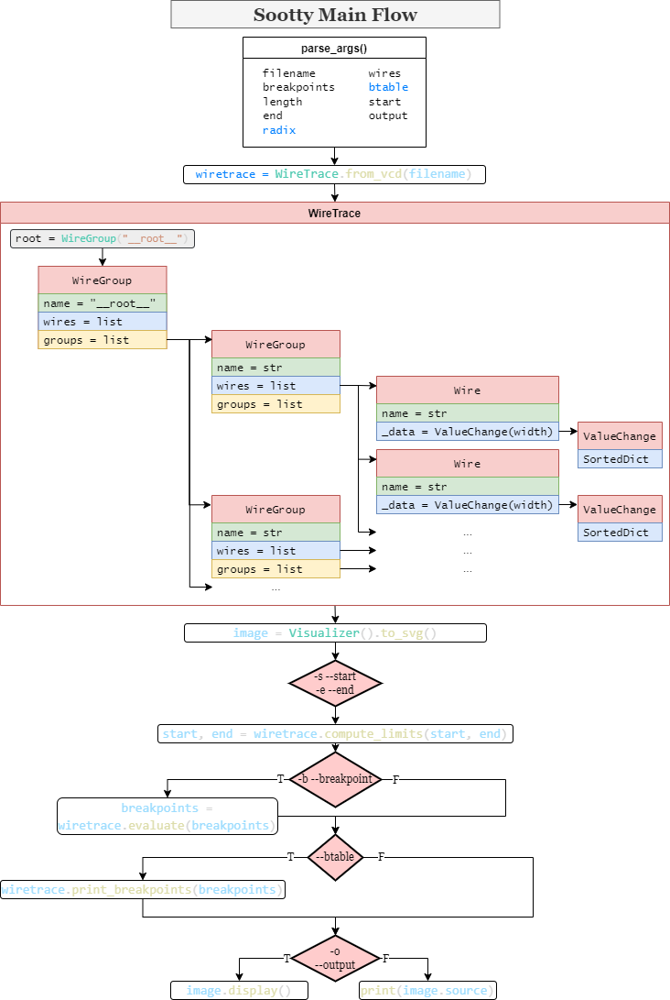

# Enhancing the `Sootty` Terminal-based Graphical Waveform Viewer

Google Summer of Code (GSoC) 2022 Free and Open Source Silicon (FOSSi) Foundation Project Report

## Introduction

Sootty is a terminal-based graphical waveform viewer that reads a Value Change Dump (VCD) file and generates an SVG picture in the terminal. Sootty is for hardware designers to conveniently and quickly view the results of their simulations. It relies on `pyvcd` to read and parse the VCD files and `lark` to provide a command-line query language to specify start points, end points, breakpoints, etc. To display output SVG pictures, only `kitty` and `iterm` terminals are applicable. The following diagram shows the main flow of Sootty from the inputs and arguments to outputs. The kernel class is the `WireTrace` class containing all the valuable information from the VCD file. The blue highlighted arguments in `parse_args()` are newly added.



## Contribution

### Milestone 1: **Add Numeral System**

In this milestone, the values of vector changes can be displayed in different numeral systems with radix from 2 to 36, instead of only decimal systems.

Code:

1. [Add numeral system for vector change data by yihuajack · Pull Request #46 · Ben1152000/sootty (github.com)](https://github.com/Ben1152000/sootty/pull/46)

Deliverables:

- New argument`-r` `—-radix` : Display values in radix N (N=2~36, default 10)
- Helper function `dec2anybase`
- Documentation

```
def dec2anybase(input, base, width):
    """
    Convert a decimal into any base (2 - 36).
    Trailing zeros are added according to input value bit size (width).
    """
    res = str()
    while input > 0:
        rem = input % base
        if rem >= 0 and rem <= 9:
            res += chr(rem + ord("0"))
        else:
            res += chr(rem - 10 + ord("A"))
        input = input // base
    return res[::-1].zfill(ceil(log(2**width - 1, base)))
```

### Milestone 2: Add EVCD to VCD Converter

In this milestone, Sootty can convert extended VCD (EVCD) files into VCD files before parsing them by `pyvcd`. EVCD is a waveform format standardized by [1800-2017 - IEEE Standard for SystemVerilog--Unified Hardware Design, Specification, and Verification Language | IEEE Standard | IEEE Xplore](https://ieeexplore.ieee.org/document/8299595). The converter can also do basic syntax checking of EVCD.

Code:

1. [Merged] [Create example4.evcd by yihuajack · Pull Request #52 · Ben1152000/sootty (github.com)](https://github.com/Ben1152000/sootty/pull/52)
2. [Merged] [Add Extended VCD (EVCD) support by yihuajack · Pull Request #55 · Ben1152000/sootty (github.com)](https://github.com/Ben1152000/sootty/pull/55)

Deliverables:

- Helper function `vcdid_hash` , `vcdid_unhash` , and `evcd_strcpy` .
- Converter function: `evcd2vcd`
- New examples `example4.evcd` , `IEEE_std_example.vcd` , `IEEE_std_example.evcd`
- Documentation

### Milestone 3: Add Breakpoints Colors and Table Printer

In this milestone, Sootty can display breakpoints in different colors. It can also print a table of wire values when breakpoints are inserted.

Code:

1. [Merged] [Add a color list for breakpoints by yihuajack · Pull Request #59 · Ben1152000/sootty (github.com)](https://github.com/Ben1152000/sootty/pull/59)
2. [Merged] [Add feature: Print breakpoint table by yihuajack · Pull Request #61 · Ben1152000/sootty (github.com)](https://github.com/Ben1152000/sootty/pull/61)
3. [Open] [WireGroup's get_names for different scopes by yihuajack · Pull Request #64 · Ben1152000/sootty (github.com)](https://github.com/Ben1152000/sootty/pull/64)

Deliverables:

- `BREAKPOINT_COLOR_LIST` in `Style` of `Visualizer` class
- Modified class function `get_names` of `WireGroup` class
- New class function `get_wires` of `WireGroup` class
- New class function `print_breakpoints` of `WireTrace` class
- Remove redundant imports
- New argument `--btable`
- Documentation

**Others**

- Code reviews of peers’ work
- Fix encoding bug: [Merged] [fix: Windows UnicodeDecodeError: 'gbk' codec by yihuajack · Pull Request #63 · Ben1152000/sootty (github.com)](https://github.com/Ben1152000/sootty/pull/63)

## Discussions

### Challenges

1. When converting radix, the "X" or "x" values must be carefully considered. The preceding zeros are complemented according to the wire widths except for the default radix 10.
2. The referenced `evcd2vcd` done by `gtkwave` written in C has some problems and issues, so our work needs to re-implement it in a pythonic way, passing different test examples.
3. Among different waveform formats except for VCD, EVCD is the simplest one, so a converter can be directly implemented in Python embedded in Sootty's `from_vcd` function. However, other waveform formats like `fsdb` are much more complicated than EVCD.
4. If `-b` and `--btable` are given simultaneously, printing the breakpoint table is done after displaying the SVG by `Popen`.
5. The function `print_breakpoints` traverses all the wires by `get_wires` recursively once to print the wire information directly. If better formatting is needed, the column widths must be determined by the maximum values of each column through `get_names`, so the wire groups must be traversed twice. If we want to determine the hierarchy of scopes to apply dot references like `testbench.pe8` when printing, the wire groups also need to be traversed once more.
6. It is the first time for me to cooperate with people in different time zones constantly, so planning schedules and remembering them are a challenge.

### Learnings

1. Practiced using Git and GitHub more
2. Improved my communication and cooperation skills on remote
3. Have developed a deeper understanding of waveform formats
4. Learned a lot about object-oriented programming (OOP) in Python
5. Learned a lot about Python `io` library and miscellaneous stuff

### Future Work 

1. Add scope information in the output SVG
2. Explore the opportunities to extend the compatibility across different platforms
3. Explore an appropriate way to support more complex waveform formats like `fsdb`
4. Find an innovative and efficient way to format the breakpoint table prettier and apply dot references on the scope

## Conclusion

To conclude, I have finished all three tasks planned in my original proposal. I feel lucky to be able to participate in GSoC and really appreciate my mentors, Jonathan Balkind and Benjamin Darnell, for their help. I really enjoyed this program during the past three months. This project inspires me to go on to explore and contribute to the world of free and open-source silicon in the future.
